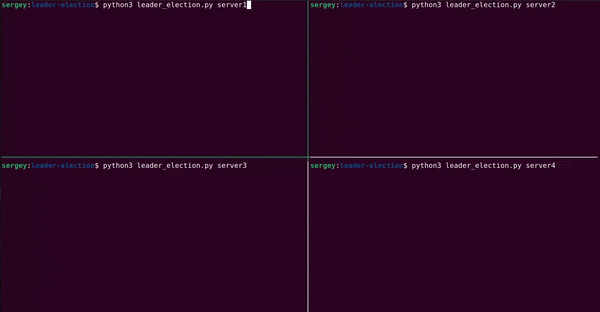

# Leader Election

Leader election is a crucial distributed systems concept where a group of nodes or servers dynamically choose one among them to act as the leader. The leader is responsible for making decisions, coordinating activities, or ensuring a single point of control in a distributed system. When a leader fails, a new leader must be elected. This README provides an example of leader election using Python and etcd, along with an explanation of the concept.

## What is Leader Election?

Leader election is a technique used in distributed systems to select a single leader from a group of nodes. The leader is responsible for performing certain tasks, and in case the leader fails, a new leader is elected. Leader election ensures coordination and fault tolerance in distributed systems.

## When to Use Leader Election

Leader election is used in various scenarios, such as:

- **High Availability**: In systems requiring constant availability, a leader can take over when the current leader fails.
- **Load Balancing**: A leader can distribute tasks among nodes.
- **Resource Locking**: Ensure exclusive access to shared resources.
- **Replication**: In database or state machines, one node is responsible for maintaining the primary copy of data.

## Example Explanation

In this example, we use Python and etcd to implement a leader election mechanism. Etcd is a distributed key-value store that can be used for service discovery and configuration. The code demonstrates how a leader is elected among a group of servers. Here's how it works:

1. The leader is chosen based on who can successfully create a key in etcd. If a server succeeds in creating this key, it becomes the leader.

2. The leader periodically renews its lease to maintain leadership. If it fails to do so, another server can take over.

3. The followers watch the leader key and, if it's deleted (i.e., the leader's lease expires), they know that leadership is up for grabs.

4. The code continuously checks if the server is the leader or a follower and performs some work when it's the leader.

## Code Overview

The code consists of several components:

- `main()`: The main entry point for the program, where leader election happens.

- `leader_election()`: Function to attempt leader election and create a lease.

- `on_leadership_gained()`: When a server becomes the leader, it continuously renews its lease and performs work.

- `wait_for_next_election()`: Used by followers to watch for leadership changes and sleep until the leader's lease expires.

- `try_insert()`: Attempt to insert a key with a lease in etcd for leader election.

- `do_work()`: Simulated work that the leader performs.

## Credentials and Hints:

You'll need to have an etcd cluster running and configure the ETCD_HOST and ETCD_PORT variables according to your setup:

    $ docker pull bitnami/etcd
    $ docker run -d --name etcd-local -p 2379:2379 -e ALLOW_NONE_AUTHENTICATION=yes bitnami/etcd

Before running the code, make sure to install the required dependencies using pip:

    $ pip install etcd3

Be sure to run the program with a unique server name as an argument, e.g.:

    $ python3 leader_election.py server1
    $ python3 leader_election.py server2
    $ python3 leader_election.py server3
    $ python3 leader_election.py server4

The example code is based on the code found at [SystemExpert - Leader Election Example](https://www.algoexpert.io/systems/fundamentals/leader-election).
