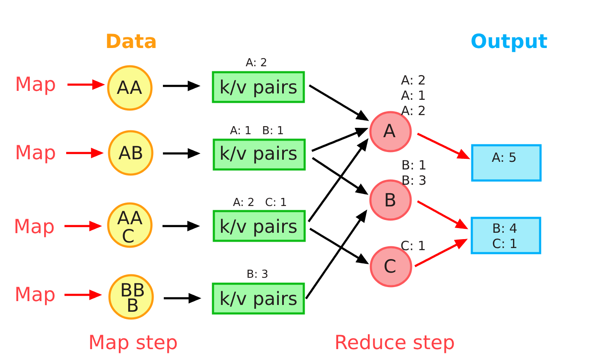

MapReduce
=========

MapReduce is a programming model for processing and generating big data sets with a parallel, distributed algorithm on a cluster.

Processing a data set that's stored across hundreds or thousands of machines is a very difficult, it's a non-trivial task, you have to paralyse the processing across all of these machines, you have to handle failures like network partitions or machine failures.

A MapReduce job is comprised of 3 main steps:

- the **Map** step, which runs a **map function** on the various chunks of the dataset and transforms these chunks into intermediate **key-value pairs**.
    
- the **Shuffle** step, which reorganizes the intermediate **key-value pairs** such that pairs of the same key are routed to the same machine in the final step.

- the **Reduce** step, which runs a **reduce function** on the newly shuffled **key-value pairs** and transforms them into more meaningful data.

    
The canonical example of a MapReduce use case is counting the number of occurrences of words in a large text file.

When dealing with a MapReduce library, engineers and/or systems administrators only need to worry about the map and reduce functions, as well as their inputs and outputs. All other concerns, including the parallelization of tasks and the fault-tolerance of the MapReduce job, are abstracted away and taken care of by the MapReduce implementation.

### Example

- **Map function**: Each host (source) has information about users' birth dates. The Map function on each host would count the occurrences of birthdays in each month. So, if there are three users with birthdays in January on one host, the Map function there would count 3 for January.

- **Intermediate step**: After the Map step, you have multiple hosts with their partial counts for each month. In the intermediate step, these partial counts are gathered and aggregated together by month. So, all the January counts from different hosts are grouped together, all the February counts are grouped together, and so on.

- **Reduce function**: Finally, in the Reduce step, the aggregated counts for each month are further combined. So, for January, you'd add up all the January counts from different hosts to get the total number of birthday occurrences in January. This process is repeated for each month.

At the end of this process, you indeed have the amount of birthday occurrences per month for users from different hosts. It's a great example of how MapReduce can efficiently handle data aggregation from various sources and provide meaningful results.

### Interact with the code

Fake data was generated using a Go script and placed in folders on various hosts. If you want to overwrite the original data, run the following commands

    $ go run faker.go -output=hosts/europe/people.csv -records=200
    $ go run faker.go -output=hosts/america/people.csv -records=200
    $ go run faker.go -output=hosts/asia/people.csv -records=200
    $ go run faker.go -output=hosts/africa/people.csv -records=200

To start a MapReduce process, you just need to run one script that contains all the instructions:

    $ ./run.sh
