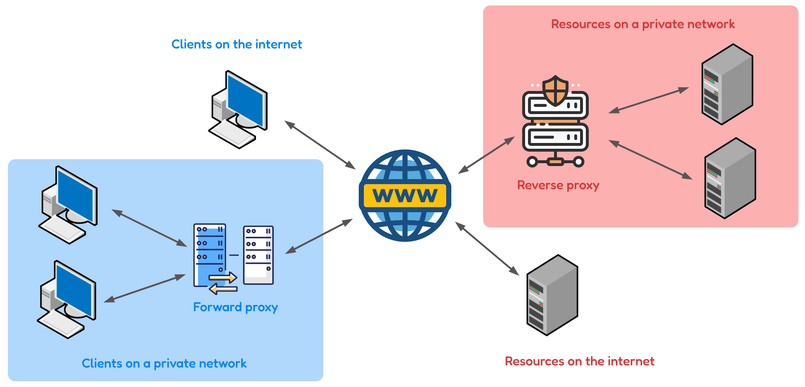
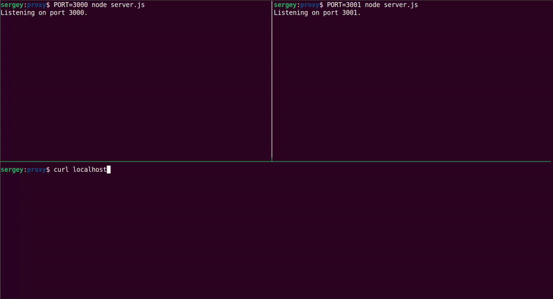

# Proxy

This repository provides a simple example of using a proxy server with Node.js and Nginx. A proxy server acts as an intermediary between client requests and the actual server, facilitating functionalities like load balancing, caching, and enhanced security. In this example, Nginx serves as the proxy server, efficiently distributing requests between two Node.js servers.

### What is a Proxy?

A proxy server acts as an intermediary between client requests and the actual server. It forwards client requests to the server and returns the server's responses to the clients. There are two main types of proxies:

- **Forward Proxy** is positioned on the client side of the interaction between the client and a server. It operates on behalf of the client, essentially working as a middleman that forwards requests from the client to the server and vice versa. In simplified terms, it's akin to how VPNs operate by providing an additional layer to shield the user's identity.

- In contrast, **Reverse Proxy** is positioned on the server side of the interaction between a client and a server. It acts on behalf of the servers, handling requests from clients and forwarding them to the appropriate server. Reverse proxies are versatile tools used for various purposes and offer versatile functionalities, including:

    * Filtering out requests that need to be ignored.
    * Handling logging for the system or gathering metrics.
    * Caching specific items, such as HTML pages.
    * Serving as a load balancer to distribute incoming traffic among multiple servers.



### When to Use a Proxy?

Consider using a proxy in the following scenarios:

- **Load Balancing**: Distribute incoming traffic across multiple servers to ensure no single server is overwhelmed. This is particularly useful in high-traffic scenarios where evenly distributing the load optimizes performance.
- **Security**: Hide the identity of the actual server and protect against direct access. Proxies can act as a barrier, adding an extra layer of security by concealing sensitive information about the underlying infrastructure.
- **Caching**: Improve response times by caching frequently accessed resources, reducing the load on backend servers. Proxies can store static content like images or HTML pages, facilitating quicker access and a more responsive user experience.

### Benefits of Using a Proxy

Utilizing a proxy offers several advantages, including:

- **SSL Termination**: Handle SSL encryption and decryption, allowing secure connections between clients and backend servers without the server bearing the overhead of SSL.
- **Threat Prevention**: Protect backend servers from malicious traffic by filtering and blocking suspicious requests. By rate-limiting or blocking such requests, reverse proxies prevent server overloads and enhance application security. Additionally, they can mask the server’s IP address, making it harder for attackers to launch DDoS attacks.
- **Scalability**: Dynamically add or remove servers, facilitating easy scaling of web applications. This feature enables administrators to handle traffic spikes or increase capacity without downtime.
- **Compression**: Compress and optimize content before sending it to clients, reducing bandwidth usage and enhancing overall performance.
- **Routing**: Route requests to specific backend servers based on criteria such as URL path, HTTP headers, or geographic location.
- **Monitoring and Logging**: Monitor traffic and log activities, offering insights into usage patterns and potential security threats.
- **Flexibility**: Modify requests and responses in real-time. This flexibility allows administrators to implement complex routing rules, rewrite URLs, and add or remove headers.

### Firewall vs Forward Proxy

While both firewalls and forward proxies play essential roles in network security, they serve distinct purposes.

A firewall is a broader network security system that monitors and controls overall incoming and outgoing network traffic based on predetermined security rules. It acts as a barrier between a secure internal network and the external, potentially untrusted, network. 

On the other hand, a forward proxy focuses specifically on managing client requests and interactions with external servers. It acts as an intermediary, forwarding client requests to the destination server and returning the server's responses to clients. Forward proxies are commonly used for tasks like content filtering, caching, and controlling access to the internet within a network. 

In summary, while firewalls provide comprehensive network security, forward proxies specialize in optimizing and controlling specific aspects of client-server interactions within a network. In some network architectures, a forward proxy and a firewall might be used together to enhance security and control over network traffic.

### Setup

- Install Node.js dependencies using Yarn:

```bash
$ yarn install
```

- Start Node.js servers:

```bash
$ PORT=3000 node server.js
$ PORT=3001 node server.js
```

- Copy the provided Nginx configuration file (`nginx.conf`) to the appropriate Nginx configuration directory. The exact path may vary based on your system, but a common location is `/etc/nginx/`. Finally, restart Nginx:

```bash
$ sudo cp nginx.conf /etc/nginx/nginx.conf
$ sudo service nginx restart
```

### Example Details

In this example:

- Two Node.js servers are started on ports 3000 and 3001.
- Nginx is configured to proxy requests to these servers using a simple load balancing strategy.
- The `proxy_set_header` directive sets a custom header (`Forwarded-Content`) in the forwarded requests.
- The Nginx server listens on port 8081.

To see the proxy in action, run the following commands multiple times:


```bash
$ curl localhost:3000 # direct access to server 1
$ curl localhost:3001 # direct access to server 2
$ curl localhost:8081
$ curl localhost:8081
$ curl localhost:8081
$ curl localhost:8081
```

Observe the logs from the Node.js servers and notice how requests are distributed between them, demonstrating the load balancing functionality of the proxy.


